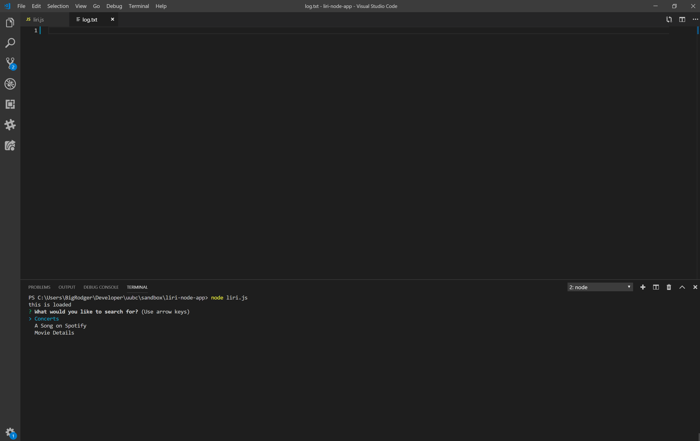
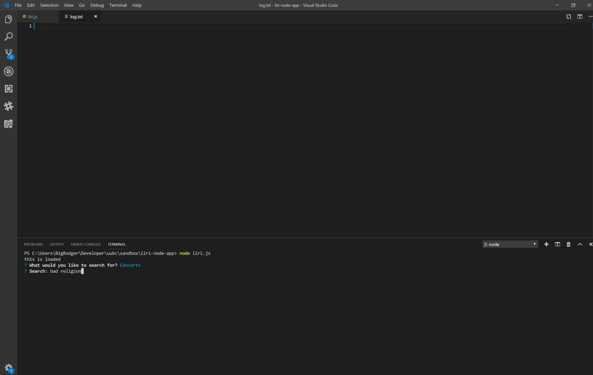
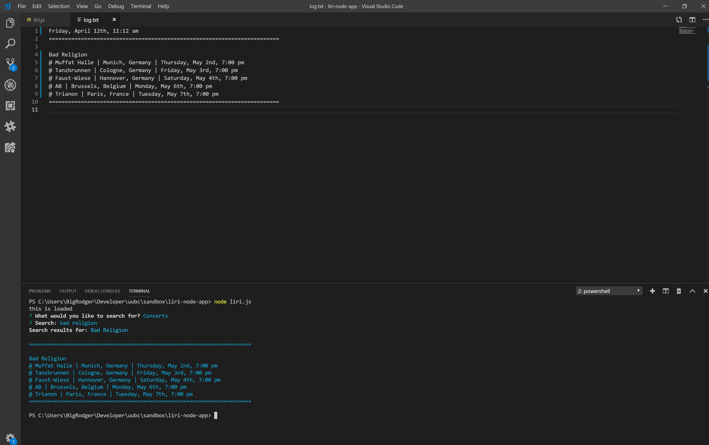
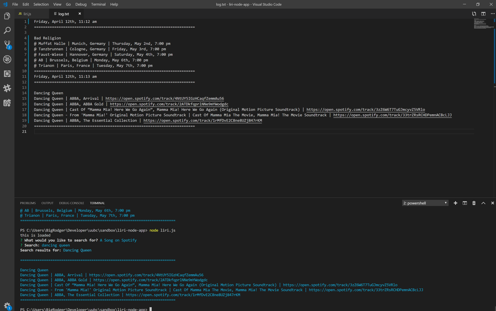

# liri-node-app

## Overview

This is a media query app built with Node.js. It uses inquirer to prompt users to search for either concerts by artist name, songs on spotify, or movie informaiton by movie title. 

First, users are prompted to choose from three search options. The following images show that prompt dialogue and results: 

If no response is given the program has a default search input.

A message is displayed if an invalid input is given.
